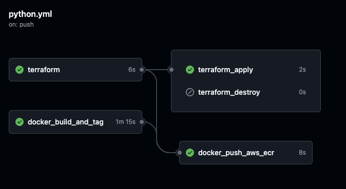

# Hugging Face on AWS SageMaker

This repository contains infrastructure code using Terraform to deploy Hugging Face models on AWS SageMaker, and Docker configurations to build and push the model images to Docker Hub.

## Table of Contents

- [Introduction](#introduction)
- [Directory Structure](#directory-structure)
- [Login to HuggingFace](#setup)
- [Setup](#setup)
- [Usage](#usage)
- [Contributing](#contributing)
- [License](#license)

## Introduction

This project aims to deploy a Hugging Face model on AWS SageMaker using custom images stored on Docker Hub. We use Terraform for infrastructure management and Docker to build and manage the Hugging Face model images.

## Directory Structure


aws/: Contains Terraform code for setting up AWS SageMaker infrastructure.

Docker/: Contains the Dockerfile, Python code, and requirements.txt for the Hugging Face model.

The whole pipeline is illustrated as 

.
├── Docker
│   ├── Dockerfile
│   ├── huggingface.py
│   └── requirements.txt
├── README.md
├── aws
│   ├── backend.tf
│   ├── data.tf
│   ├── provider.tf
│   ├── sagemaker.tf
│   └── variable.tf
└── git_pipeline.png

## Login to HuggingFace
 ```bash
pip install huggingface_hub
```

# You already have it if you installed transformers or datasets

 ```bash
huggingface-cli login
```

 ```bash
# Log in using a token from huggingface.co/settings/tokens
# Create a model or dataset repo from the CLI if needed
```

 ```bash
huggingface-cli repo create repo_name --type {model, dataset, space}
```

# Clone your model, dataset or Space locally

 ```bash
# Make sure you have git-lfs installed
# (https://git-lfs.github.com)
git lfs install
git clone https://huggingface.co/username/repo_name
``` 
Then add, commit and push any file you want, including larges files
 ```bash
# save files via `.save_pretrained()` or move them here
git add .
git commit -m "commit from $USER"
git push
``` 
In most cases, if you're using one of the compatible libraries, your repo will then be accessible from code, through its identifier: username/repo_name

For example for a transformers model, anyone can load it with:

 ```bash
tokenizer = AutoTokenizer.from_pretrained("username/repo_name")
model = AutoModel.from_pretrained("username/repo_name")
```

## Setup

### Prerequisites

- Docker
- Terraform
- AWS account with the necessary permissions
- Docker Hub account
- GitLab CI/CD setup

### Steps

1. **Clone the Repository**

   ```bash
   git clone https://github.com/Tafehi/Natural-language-processing.git
   cd Natural-language-processing
   ´´´
2. **Set up Terraform**

   ```bash
    cd aws
    terraform init
    terraform plan
    terraform apply
   ´´´

3. **Build and Push Docker Image**
This will be handled by GitLab CI/CD as per the pipeline configuration.